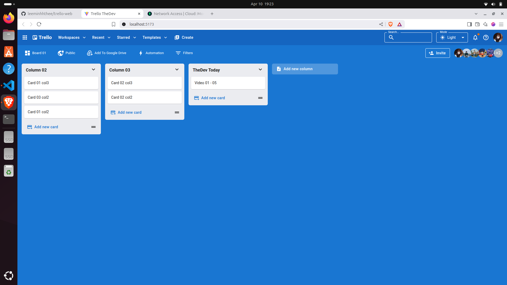
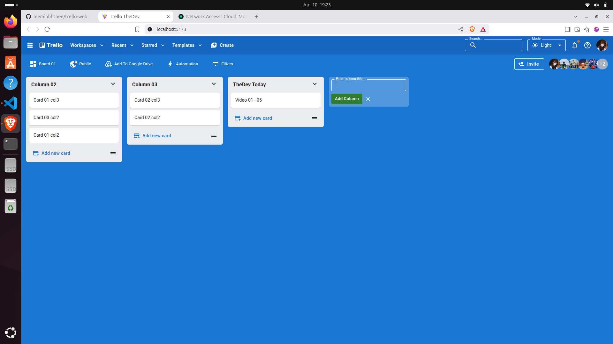
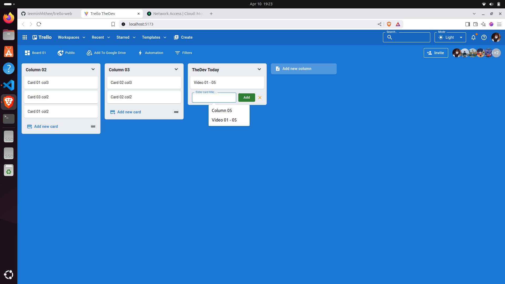
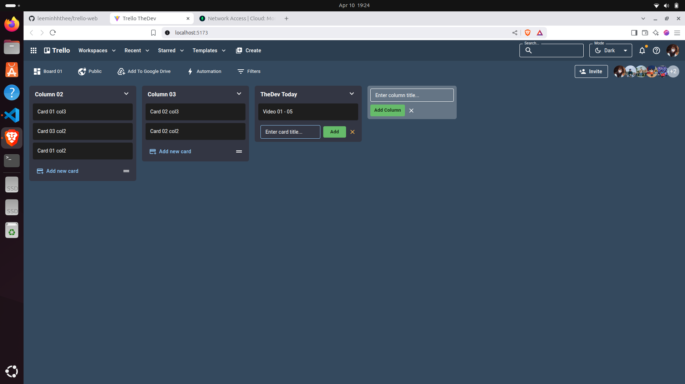
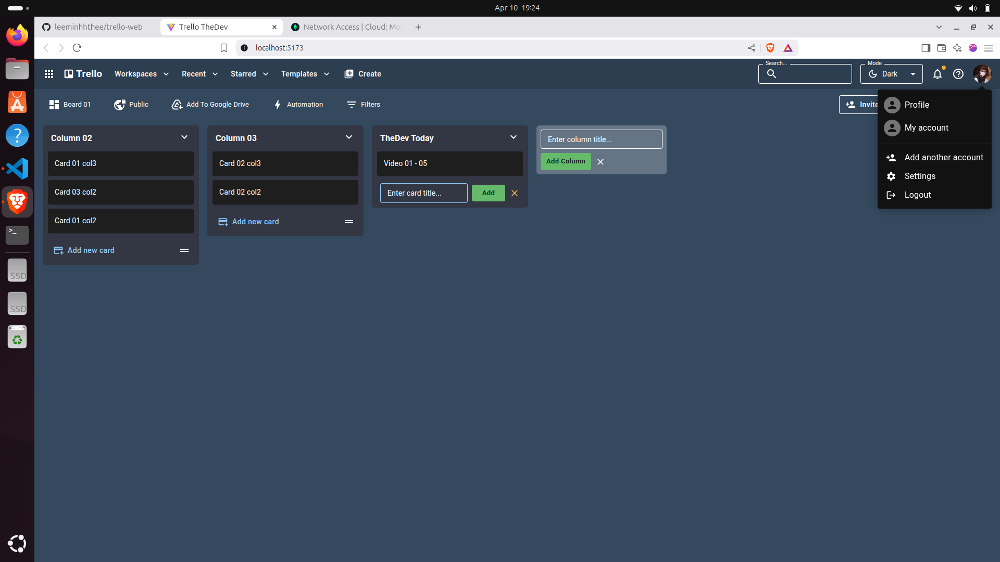

# Trello Web Clone 📝

A Trello clone built using the MERN Stack, allowing users to create boards, lists, and cards to manage tasks in a Kanban-style workflow.

## 🚀 Features

- User registration and login (further development)
- Create and manage boards (further development)
- Add lists within boards
- Add cards within lists
- Drag and drop cards across lists
- Edit card titles and descriptions (further development)
- Fully responsive UI; Dark/light/system mode

## 🛠️ Technologies Used

- **Frontend:** React.js, Material UI, DnDKit
- **Backend:** Node.js, Express.js
- **Database:** MongoDB
- **Clean Code:** Eslint
- **Deployment:** Vercel (Frontend), Render (Backend)

## ⚙️ Getting Started

### 1. Clone repository

```bash
git clone https://github.com/leeminhhthee/trello-web.git
cd trello-web
```
## Note: You need to clone the backend from this link before running the frontend:
👉 https://github.com/leeminhhthee/trello-api

### 2. Setup and Run

```bash
yarn install
yarn dev
```

## 🌍 Deployment

Live demo available at: 
👉 https://trello-web-cyan.vercel.app

## 🤝 Contribution

Contributions are welcome!
Feel free to open an issue or submit a pull request to improve this project.

## 🖼️ Hình Ảnh Giao Diện

| Dashboard | Board View | Task Details |
|-----------|------------|--------------|
|  |  |  |
|  |  | |
